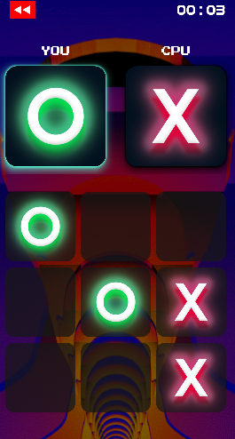

  <h1>:x: Tic Tac Toe :o:</h1>
  
  

    Neon themed tic tac toe made with Java
  

  

<!-- About the Project -->
## :star2: About the Project
Get ready to enjoy the classic game of Tic Tac Toe with a modern twist! This Android game, developed using Java, features a stylish neon theme and captivating animations with Lottie. With rewind function, while the immersive background music and sound effects keep you engaged. The game also store your records, allowing you to track your progress and achievements.

<!-- Screenshots -->
### :camera: Screenshots

 
  

<!-- TechStack -->
### :space_invader: Tech Stack

  
Android

  <ul>
    <li><a href="https://www.java.com/">Java</a></li>
    <li><a href="https://developer.android.com/reference/android/media/SoundPool">SoundPool</a></li>
    <li><a href="https://developer.android.com/reference/android/media/MediaPlayer">MediaPlayer</a></li>
    <li><a href="https://lottiefiles.com/">Lottie</a></li>
  </ul>

Database

  <ul>
    <li><a href="https://www.sqlite.org/">SQLite</a></li>
  </ul>

<!-- Features -->
### :dart: Features

- **Side Selection**\

- **CPU opponent**\

- **Rewind (regret button)**\

- **Hypermode (5x5)**\

- **Game record**\

